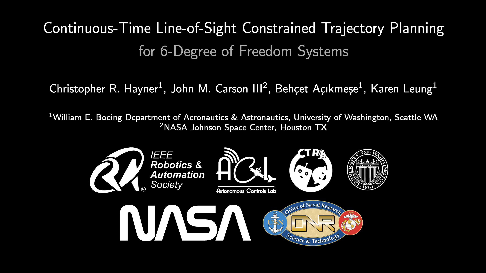

<!-- Improved compatibility of back to top link: See: https://github.com/othneildrew/Best-README-Template/pull/73 -->
<a id="readme-top"></a>
<!--
*** Thanks for checking out the Best-README-Template. If you have a suggestion
*** that would make this better, please fork the repo and create a pull request
*** or simply open an issue with the tag "enhancement".
*** Don't forget to give the project a star!
*** Thanks again! Now go create something AMAZING! :D
-->


<!-- PROJECT SHIELDS -->
<!--
*** I'm using markdown "reference style" links for readability.
*** Reference links are enclosed in brackets [ ] instead of parentheses ( ).
*** See the bottom of this document for the declaration of the reference variables
*** for contributors-url, forks-url, etc. This is an optional, concise syntax you may use.
*** https://www.markdownguide.org/basic-syntax/#reference-style-links
-->
<!-- [![Contributors][contributors-shield]][contributors-url]
[![Forks][forks-shield]][forks-url]
[![Stargazers][stars-shield]][stars-url]
[![Issues][issues-shield]][issues-url]
[![MIT License][license-shield]][license-url]
[![LinkedIn][linkedin-shield]][linkedin-url] -->

<!-- PROJECT LOGO -->
<br />
<div align="center">
<h1 align="center">Continuous-Time Line-of-Sight Constrained Trajectory Planning for Six Degree of Freedom Systems</h1>

<div style="display: flex; flex-wrap: wrap; justify-content: center;">
<!--   <div style="text-align: center;"> -->

<!-- <div style="width 45%">
<p width="10"><em>Proposed Rel Nav</em></p>
</div> -->
<!--   <div style="text-align: center;"> -->

<!-- <div style="width 45%">
<p><em>Baseline Rel Nav</em></p>
</div> -->
</div>

<div style="display: flex; flex-wrap: wrap; justify-content: center;">
<!--   <div style="text-align: center;"> -->

<!-- <p><em>Proposed Cinematography</em></p> -->
<!--   </div> -->
<!--   <div style="text-align: center;"> -->

<!-- <p><em>Baseline Cinematography</em></p> -->
<!--   </div> -->
</div>

[](https://youtu.be/miYeYnfvZYs?si=aYggTma7bdm_umCP)

  <p align="left">
    Perception algorithms are ubiquitous in modern autonomy stacks, providing necessary environmental information to operate in the real world.
    Many of these algorithms depend on the visibility of keypoints, which must remain within the robot’s line-of-sight (LoS), for reliable operation. 
    This paper tackles the challenge of maintaining LoS on such keypoints during robot movement. 
    We propose a novel method that addresses these issues by ensuring applicability to various sensor footprints, adaptability to arbitrary nonlinear dynamics and constantly enforces LoS throughout the robot's path. 
    We show through our experiments that the proposed approach achieves significantly reduced LoS violation and runtime when compared to existing state-of-the-art methods in several representative and challenging scenarios.
    <br />
  </p>
</div>

<!-- GETTING STARTED -->
## Getting Started


### Installation
The main packages are:
- ```cvxpy``` - is used to formulation and solve the convex subproblems
- ```jax``` - is used for determining the Jacobians using automatic differentiation as well as the just-in-time (JIT) compilation of the dynamics and their Jacobians 
- ```numpy``` - is used for numerical operations
- ```scipy``` - is used for the numerical integration of the dynamics
- ```pyaml```  - is used for reading the configuration files
- ```termcolor``` - is used for pretty command line output
- ```plotly``` - is used for all visualizations


These can be installed via conda or pip.
<details>
<summary>Via Conda (Recommended) </summary>

1. Clone the repo
   ```sh
   git clone https://github.com/haynec/los_guidance.git
   ```
2. Install environment packages (this will take about a minute or two):
   ```sh
   conda env create -f environment.yml
   ```
3. Activate the environment:
   ```sh
   conda activate los_guidance
   ```

</details>

<details>

<summary>Via Pip</summary>

0. Prerequisites
   Python = 3.11
1. Clone the repo
   ```sh
   git clone https://github.com/haynec/los_guidance.git
   ```
2. Install environment packages:
   ```sh
   pip install -r requirements.txt
   ```
</details>

<p align="right">(<a href="#readme-top">back to top</a>)</p>


<!-- USAGE EXAMPLES -->
## Usage

The main script is ```main.py``` which can be run with the following command:
```sh
python main.py --params-file quadsim/params/dr_vp.py --plot trajectory
```
The valid options for the ```--params-file``` flag are:
- ```quadsim/params/dr_vp.py``` - the relative navigation scenario using CT-LoS
- ```quadsim/params/dr_vp_nodal.py``` - the relative navigation scenario using DT-LoS
- ```quadsim/params/cinema_vp.py``` - the cinematography scenario using CT-LoS
- ```quadsim/params/cinema_vp_nodal.py``` - the cinematography scenario using DT-LoS.

You can also add the ```--plot``` flag to visualize the results, in which case the valid options are the following:
- ```trajectory``` - plots the 3D trajectory and the LoS constraints as an animation
- ```camera_view``` - plots the camera view of the keypoints as an animation
- ```conic_view``` - plots the conic view of the keypoints as an animation
- ```scp_iters``` - plots the SCvx iterations
- ```constr_vio``` - plots the LoS constraint violation
- ```control``` - plots the control inputs
- ```losses``` - plots the components of the convex subproblems objective
- ```states``` - plots the full state trajectory of the system


<p align="right">(<a href="#readme-top">back to top</a>)</p>

## Acknowledgements
This work was supported by a NASA Space Technology Graduate Research Opportunity and the Office of Naval Research under grant N00014-17-1-2433. The authors would like to acknowledge Natalia Pavlasek, Griffin Norris, Samuel Buckner, and Purnanand Elango for their many helpful discussions and support throughout this work.

<!-- LICENSE -->
## License

Distributed under the GPL-3.0 License. See `LICENSE.txt` for more information.

<p align="right">(<a href="#readme-top">back to top</a>)</p>


<!-- MARKDOWN LINKS & IMAGES -->
<!-- https://www.markdownguide.org/basic-syntax/#reference-style-links -->
[contributors-shield]: https://img.shields.io/github/contributors/haynec/los_guidance.svg?style=for-the-badge
[contributors-url]: https://github.com/haynec/los_guidance/graphs/contributors
[forks-shield]: https://img.shields.io/github/forks/haynec/los_guidance.svg?style=for-the-badge
[forks-url]: https://github.com/haynec/los_guidance/network/members
[stars-shield]: https://img.shields.io/github/stars/haynec/los_guidance.svg?style=for-the-badge
[stars-url]: https://github.com/haynec/los_guidance/stargazers
[issues-shield]: https://img.shields.io/github/issues/haynec/los_guidance.svg?style=for-the-badge
[issues-url]: https://github.com/haynec/los_guidance/issues
[license-shield]: https://img.shields.io/github/license/haynec/los_guidance.svg?style=for-the-badge
[license-url]: https://github.com/haynec/los_guidance/blob/master/LICENSE.txt
[linkedin-shield]: https://img.shields.io/badge/-LinkedIn-black.svg?style=for-the-badge&logo=linkedin&colorB=555
[linkedin-url]: https://linkedin.com/in/linkedin_username
[product-screenshot]: images/screenshot.png
[Next.js]: https://img.shields.io/badge/next.js-000000?style=for-the-badge&logo=nextdotjs&logoColor=white
[Next-url]: https://nextjs.org/
[React.js]: https://img.shields.io/badge/React-20232A?style=for-the-badge&logo=react&logoColor=61DAFB
[React-url]: https://reactjs.org/
[Vue.js]: https://img.shields.io/badge/Vue.js-35495E?style=for-the-badge&logo=vuedotjs&logoColor=4FC08D
[Vue-url]: https://vuejs.org/
[Angular.io]: https://img.shields.io/badge/Angular-DD0031?style=for-the-badge&logo=angular&logoColor=white
[Angular-url]: https://angular.io/
[Svelte.dev]: https://img.shields.io/badge/Svelte-4A4A55?style=for-the-badge&logo=svelte&logoColor=FF3E00
[Svelte-url]: https://svelte.dev/
[Laravel.com]: https://img.shields.io/badge/Laravel-FF2D20?style=for-the-badge&logo=laravel&logoColor=white
[Laravel-url]: https://laravel.com
[Bootstrap.com]: https://img.shields.io/badge/Bootstrap-563D7C?style=for-the-badge&logo=bootstrap&logoColor=white
[Bootstrap-url]: https://getbootstrap.com
[JQuery.com]: https://img.shields.io/badge/jQuery-0769AD?style=for-the-badge&logo=jquery&logoColor=white
[JQuery-url]: https://jquery.com 
